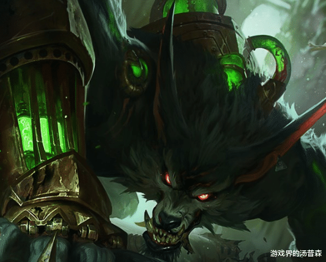

## warwick
Warwick is a former Zaunite Zaunite gangster who decided to abandon his former life to try and be a 'good man'. He was captured and experimented on by Singed Singed, who pumped him full of chemicals containing spliced monster DNA in an attempt to transmute the Uncaged Wrath of Zaun into the 'beast' he was deep down inside. The experiments ended up killing him only to have him resurrect as a chimera resembling a werewolf.
	
